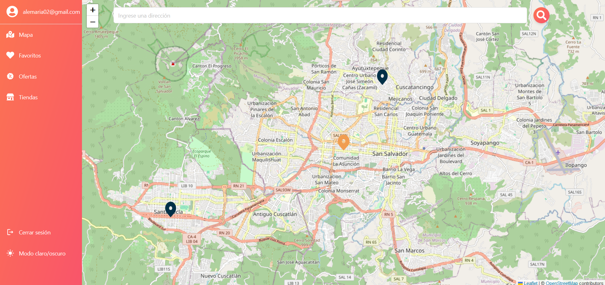
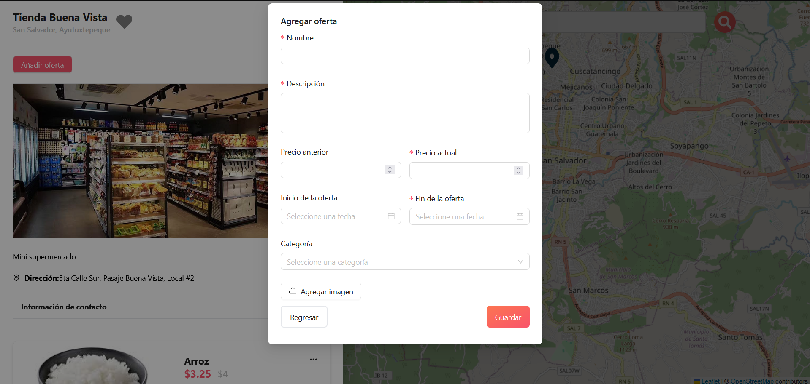

# Manual de Usuario - Ahorra Ya

Bienvenido al manual de usuario de Ahorra Ya. Este documento le guiará a través de las funcionalidades básicas de la aplicación.

## Inicio de Sesión

Para iniciar sesión en la aplicación, ingrese su nombre de usuario y contraseña en los campos correspondientes. También puede iniciar sesión con su cuenta de Google.

## Registro y Establecer Contraseña

Si es un nuevo usuario, deberá registrar su cuenta y establecer una contraseña. Siga las instrucciones en pantalla para completar estos pasos.

## Pantalla Principal - Mapa

Una vez que haya iniciado sesión, será dirigido a la pantalla principal donde puede ver un mapa. Desde aquí, puede acceder a diferentes secciones como Mapa, Favoritos, Ofertas, y Tiendas.

## Búsqueda de Ubicación

Use la barra de búsqueda en la parte superior para encontrar ubicaciones específicas en el mapa. Simplemente ingrese la dirección deseada y presione el icono de búsqueda.

## Agregar Tienda

Para agregar una nueva tienda, haga clic en "Agregar tienda" y complete el formulario con la información requerida: nombre, descripción, contacto, dirección, etc.

## Información de Tienda

Al seleccionar una tienda en el mapa, podrá ver la información detallada de la misma, incluyendo la dirección, contacto y ofertas disponibles.

## Agregar Oferta

Para agregar una nueva oferta a una tienda, haga clic en "Añadir oferta" y complete el formulario con los detalles de la oferta, como nombre, descripción, precio y fechas de validez.

## Editar Oferta

Para editar una oferta existente, seleccione "Editar" en la información de la tienda y actualice los detalles en el formulario.

## Editar o Eliminar Oferta

Puede editar o eliminar una oferta existente seleccionando la opción correspondiente en el menú de la oferta.

## Agregar Tienda a Favoritos

Para agregar una tienda a sus favoritos, haga clic en el icono del corazón en la información de la tienda.

## Módulo de Favoritos

En el módulo de favoritos, puede ver todas las tiendas que ha marcado como favoritas.

## Módulo de Ofertas

En el módulo de ofertas, puede ver todas las ofertas disponibles. Puede filtrar las ofertas utilizando la barra de búsqueda.

## Buscar Oferta por Nombre

Para buscar una oferta específica, ingrese el nombre de la oferta en la barra de búsqueda del módulo de ofertas.

## Módulo de Tiendas

En el módulo de tiendas, puede ver todas las tiendas registradas en la aplicación. Puede filtrar las tiendas utilizando la barra de búsqueda.

## Buscar Tienda por Nombre

Para buscar una tienda específica, ingrese el nombre de la tienda en la barra de búsqueda del módulo de tiendas.

## Buscar Tienda por Departamento

Para buscar una tienda por departamento, ingrese el nombre del departamento en la barra de búsqueda del módulo de tiendas.

## Buscar Tienda por Municipio

Para buscar una tienda por municipio, ingrese el nombre del municipio en la barra de búsqueda del módulo de tiendas.

## Editar Tienda

Para editar la información de una tienda, seleccione "Editar" en la información de la tienda y actualice los detalles en el formulario.

